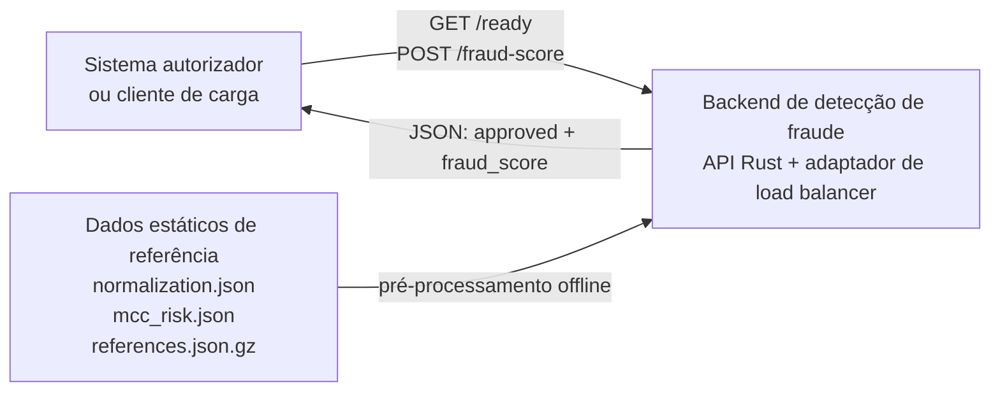
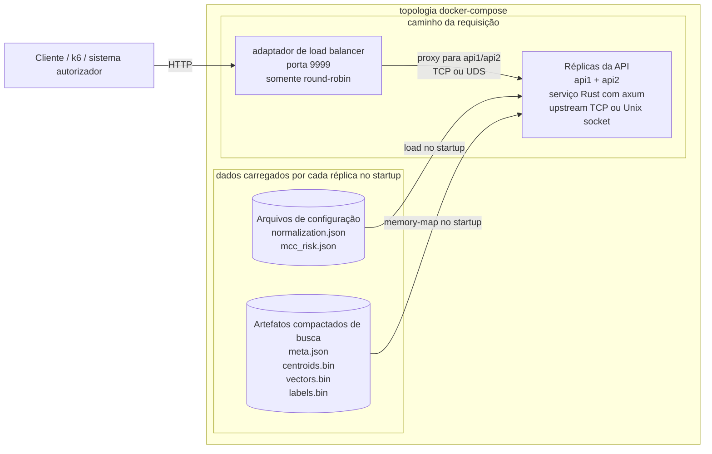
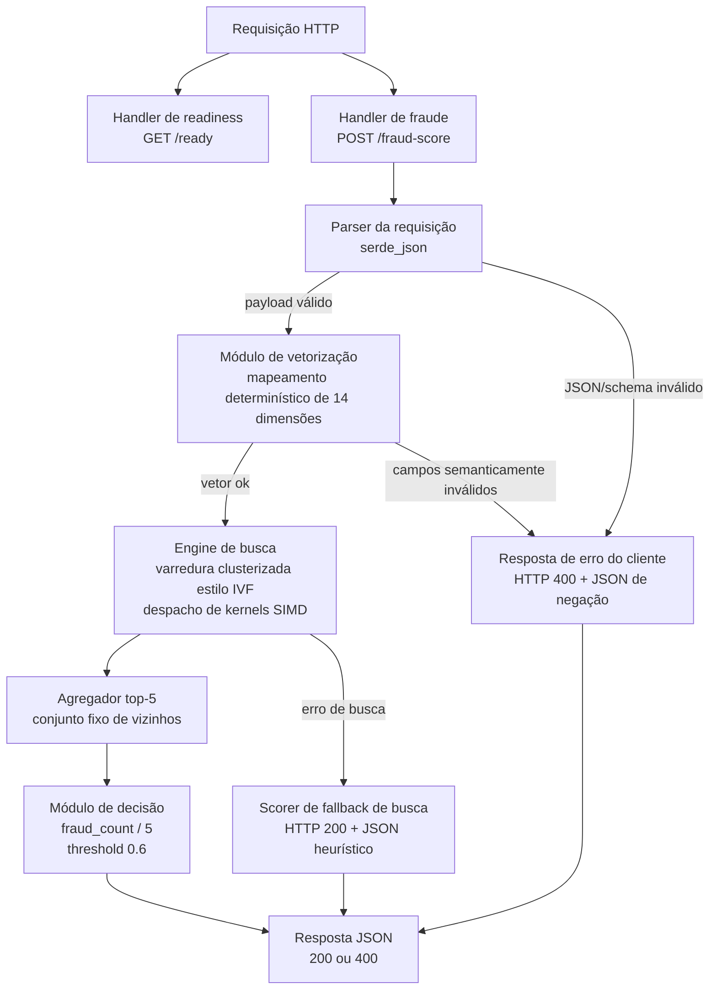
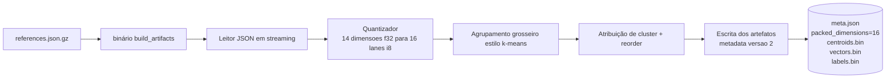
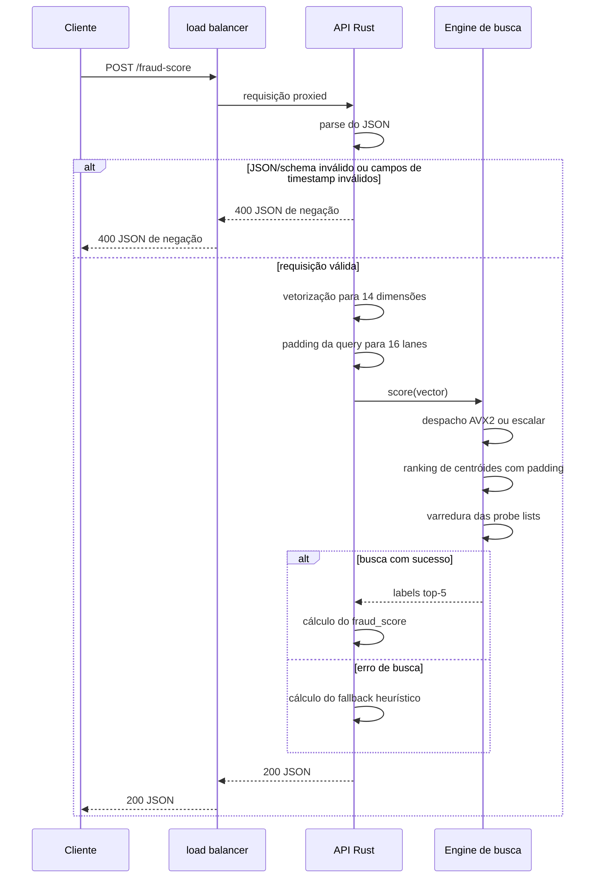

# Implementação em C4

Este documento descreve a implementação Rust atual adicionada neste repositório, e não apenas a topologia genérica da competição. O foco aqui é a composição real de runtime, os componentes internos da API e o pipeline offline que prepara os dados de busca vetorial.

Arquivos relevantes:

- [`docker-compose.yml`](../../docker-compose.yml)
- [`lb/nginx.conf`](../../lb/nginx.conf)
- [`lb/haproxy-tcp.cfg`](../../lb/haproxy-tcp.cfg)
- [`lb/haproxy-uds.cfg`](../../lb/haproxy-uds.cfg)
- [`src/bin/server.rs`](../../src/bin/server.rs)
- [`src/lib.rs`](../../src/lib.rs)
- [`src/search.rs`](../../src/search.rs)
- [`src/bin/build_artifacts.rs`](../../src/bin/build_artifacts.rs)

## Nível 1: Contexto do Sistema



### Notas

- O backend é um sistema isolado de score de fraude. Ele recebe o payload da transação e devolve a decisão.
- O dataset grande de referência não é consultado como JSON bruto em tempo de requisição. Ele é transformado em artefatos compactos antes da API começar a servir tráfego.

## Nível 2: Diagrama de Containers



### Notas

- O load balancer não executa lógica de negócio. Ele apenas encaminha requisições para as duas instâncias upstream.
- O compose raiz usa nginx por padrão. Overlays de compose podem trocar o adaptador para HAProxy sobre TCP ou HAProxy sobre Unix sockets sem alterar o código da API ou os scripts de carga.
- Cada instância da API carrega o mesmo conjunto de artefatos read-only e responde de forma independente.
- As instâncias da API não dependem de banco externo, cache ou vector store no hot path.

## Nível 3: Diagrama de Componentes da API



### Responsabilidades dos componentes

- **Parser da requisição**: desserializa o corpo JSON de entrada para os DTOs Rust.
- **Módulo de vetorização**: aplica o mapeamento exato das 14 dimensões definido no desafio, incluindo extração UTC de hora/dia, sentinelas `-1` para ausência de última transação, clamp e fallback de MCC.
- **Resposta de erro do cliente**: retorna `400 Bad Request` com JSON de negação para JSON malformado, campos ausentes, tipos incorretos ou campos semanticamente inválidos, como timestamps malformados.
- **Engine de busca**: faz padding e quantização do vetor da requisição, ranqueia centróides grosseiros, percorre um número limitado de listas invertidas e calcula distância Euclidiana quadrática sobre vetores compactados.
- **Despacho de kernels SIMD**: seleciona kernels `AVX2` no startup em `x86_64` quando disponíveis; caso contrário, usa as implementações escalares.
- **Agregador top-5**: mantém os cinco candidatos mais próximos sem precisar alocar uma estrutura grande para ordenar tudo.
- **Módulo de decisão**: converte os cinco rótulos em `fraud_score` e `approved`.
- **Scorer de fallback de busca**: devolve JSON válido com `200` para requisições válidas quando a engine de busca falha, preservando disponibilidade durante a pontuação.

## Nível 4: Pipeline de Construção dos Artefatos



### Notas

- O builder processa o array gzipado em streaming e não exige um JSON expandido no runtime.
- Os vetores são quantizados das 14 dimensões lógicas para 16 lanes de bytes assinados; as 2 lanes finais ficam zeradas para favorecer cargas SIMD.
- Os centróides também são gravados como registros de 16 lanes, com as 2 lanes finais de `f32` zeradas.
- O `meta.json` agora carrega `version = 2` e `packed_dimensions = 16`, fazendo com que artefatos antigos falhem rapidamente em vez de serem carregados de forma incorreta.
- O armazenamento reordenado por cluster mantém cada lista invertida contígua, o que torna a leitura por probe mais sequencial e amigável ao cache.

## Ciclo de Vida da Requisição



## Variantes de load balancer

A API expõe um contrato estável de upstream:

- `LISTEN_MODE=tcp|unix`, padrão `tcp`.
- `BIND_ADDR=0.0.0.0:9999` no modo TCP.
- `BIND_SOCKET=/sockets/apiN.sock` no modo Unix socket.

O contrato visto pelo cliente não muda: a stack continua expondo `GET /ready` e `POST /fraud-score` na porta `9999` do host.

## Observabilidade para testes de carga

A imagem da API tem observabilidade opcional via stdout para testes locais de carga. Ela não adiciona rotas, sidecars ou serviços, então a API pública continua limitada a `GET /ready` e `POST /fraud-score`.

Ative com variáveis de ambiente:

```bash
docker compose -f docker-compose.yml -f docker-compose.observability.yml up --build
```

Depois rode o teste de carga e acompanhe as duas instâncias:

```bash
docker compose logs -f api1 api2
```

A cada `OBS_INTERVAL_SECS` segundos, cada instância emite uma linha agregada com taxa de requisições, contagens de aprovação/negação, erros de parse/vetorização/busca, taxa de fallback heurístico, buckets de `fraud_score`, buckets de latência, bucket p99 estimado, quantidade de probes, arquitetura alvo e kernels SIMD selecionados.

Knobs úteis:

- `OBSERVABILITY=1` ativa o log agregado.
- `OBS_INTERVAL_SECS=5` controla o intervalo de log e é limitado a no mínimo um segundo.
- `RUST_LOG=debug` ativa diagnósticos por requisição em caminhos degradados. Mantenha o padrão `info` durante medições sérias de p99.

## Perfis de Build

A imagem Docker suporta dois perfis de CPU via `BUILD_CPU_PROFILE`:

- `generic` é o padrão. Ele gera um binário `linux/amd64` portátil e ainda usa despacho AVX2 em runtime quando o host expõe AVX2.
- `haswell` é o perfil orientado à submissão. Ele compila o servidor com `target-cpu=haswell` e features explícitas `+avx2,+fma,+sse4.2,+popcnt`.

Use o perfil Haswell apenas em máquinas `x86_64` com AVX2:

```bash
BUILD_CPU_PROFILE=haswell PROBE_COUNT=6 docker compose -f docker-compose.yml -f docker-compose.observability.yml up --build
```

Em um host Intel Mac antigo, verifique primeiro se o macOS expõe AVX2. Por exemplo, um MacBook Pro mid-2014 com i5-4278U é Haswell e pode ser usado quando `hw.optional.avx2_0` é `1`:

```bash
sysctl -n machdep.cpu.brand_string
sysctl -a | grep -i avx2
```

O limitador prático em macOS antigo, como Big Sur, é o suporte do Docker Desktop, não a CPU. Versões atuais do Docker Desktop não suportam mais Big Sur, então use uma versão antiga do Docker Desktop em uma máquina isolada de benchmark ou instale Linux no MacBook e use Docker Engine.

Depois de instalar o Docker, confirme que o container Linux enxerga AVX2:

```bash
docker run --rm --platform linux/amd64 debian:bookworm-slim \
  sh -lc 'grep -m1 flags /proc/cpuinfo | grep -qw avx2 && echo avx2=yes || echo avx2=no'
```

Então valide o despacho em runtime antes de confiar nos números de carga:

```bash
BUILD_CPU_PROFILE=haswell SIMD_REQUIRE_AVX2=1 SIMD_EXPECT_AVX2=1 ./scripts/validate-simd-container.sh
```

Os logs esperados de startup e observabilidade devem incluir `build_cpu_profile="haswell"`, `target_arch="x86_64"`, `avx2_detected=true`, `candidate_kernel=Avx2` e `centroid_kernel=Avx2`. O builder dos artefatos ainda roda pelo caminho genérico durante o build Docker; apenas o binário de runtime do servidor usa o perfil de CPU selecionado.

## Intenção do Design

- Manter o caminho da requisição autocontido e somente leitura após o startup.
- Empurrar o trabalho pesado do dataset para uma etapa offline de build.
- Fazer padding de vetores e centróides para 16 lanes para permitir cargas SIMD simples no runtime, sem lógica de cauda para registros de 14 dimensões.
- Retornar `400` explícito para erros de payload do cliente e manter falhas internas de busca em requisições válidas no fallback heurístico com `200`.
- Manter a topologia de runtime compatível com a exigência da competição de um load balancer e duas instâncias de API.

[← README em português](./README.md)
