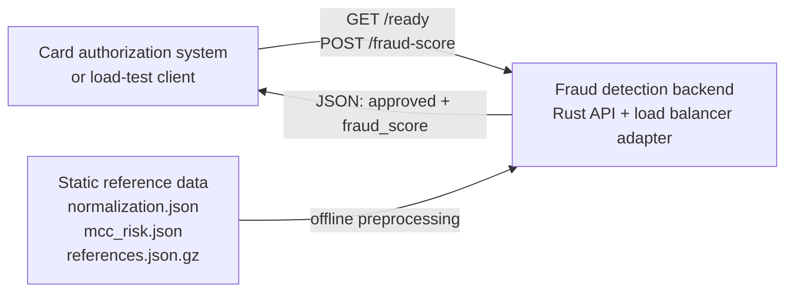
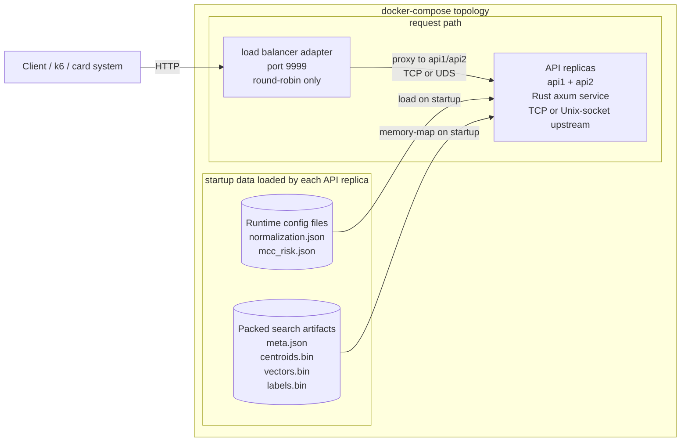
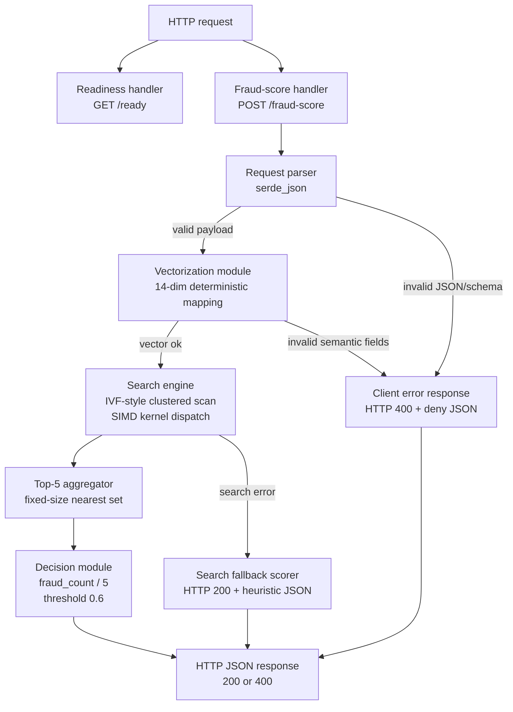
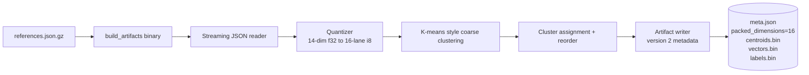
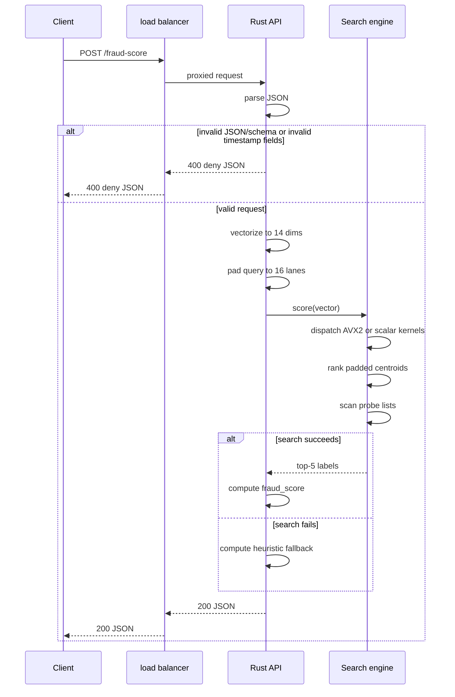

# Implementation C4

This document describes the current Rust implementation added in this repository, not the generic competition topology. It focuses on the concrete runtime services, the internal components of the API, and the offline artifact pipeline that prepares the vector-search data.

Relevant source files:

- [`docker-compose.yml`](../../docker-compose.yml)
- [`docker-compose.lb-custom.yml`](../../docker-compose.lb-custom.yml)
- [`lb/nginx.conf`](../../lb/nginx.conf)
- [`lb/haproxy-tcp.cfg`](../../lb/haproxy-tcp.cfg)
- [`lb/haproxy-uds.cfg`](../../lb/haproxy-uds.cfg)
- [`src/bin/lb.rs`](../../src/bin/lb.rs)
- [`src/bin/server.rs`](../../src/bin/server.rs)
- [`src/lib.rs`](../../src/lib.rs)
- [`src/search.rs`](../../src/search.rs)
- [`src/bin/build_artifacts.rs`](../../src/bin/build_artifacts.rs)

## Level 1: System Context



### Notes

- The backend is an isolated fraud-scoring system. It receives transaction payloads and returns a decision.
- The large reference dataset is not queried as raw JSON at request time. It is transformed into compact artifacts before the API starts serving traffic.

## Level 2: Container Diagram



### Notes

- The load balancer performs no business logic. It only forwards requests to the two upstream API containers.
- The default root compose file uses nginx. Overlay compose files can swap the adapter to HAProxy over TCP, HAProxy over Unix sockets, or the custom Rust LB (`docker-compose.lb-custom.yml`) without changing API code or load-test scripts.
- Each API instance loads the same read-only artifact set and answers requests independently.
- The API containers do not depend on an external database, cache, or vector store in the hot path.

## Level 3: API Component Diagram



### Component responsibilities

- **Request parser**: deserializes the incoming JSON body into the Rust DTOs.
- **Vectorization module**: applies the exact 14-dimension mapping from the challenge rules, including UTC hour/day extraction, `-1` sentinels for missing last-transaction fields, clamping, and MCC fallback.
- **Client error response**: returns `400 Bad Request` with a deny JSON body for malformed JSON, missing fields, wrong field types, or semantically invalid fields such as malformed timestamps.
- **Search engine**: pads and quantizes the request vector, ranks coarse centroids, probes a bounded number of inverted lists, and computes squared Euclidean distance over packed vectors.
- **SIMD kernel dispatch**: selects `AVX2` kernels at startup on `x86_64` when available, otherwise uses the scalar implementations.
- **Top-5 aggregator**: maintains the current nearest five candidates without allocating a large sortable structure.
- **Decision module**: converts the five labels into `fraud_score` and `approved`.
- **Search fallback scorer**: returns valid `200` JSON for valid requests when the search engine fails, preserving availability during scoring.

## Level 4: Artifact Build Pipeline



### Notes

- The builder streams the gzipped reference array and does not require a raw expanded JSON file in the runtime image.
- Vectors are quantized from 14 logical dimensions into 16 signed-byte lanes; the last 2 lanes are zero padding for SIMD-friendly loads.
- Centroids are also stored as 16-lane records, with the last 2 `f32` lanes zeroed.
- `meta.json` now carries artifact `version = 2` and `packed_dimensions = 16`, so old artifacts fail fast instead of loading incorrectly.
- Reordered per-cluster storage keeps each inverted list contiguous, which makes probe scans sequential and cache-friendlier.

## Request Lifecycle



## Load-balancer variants

The API exposes a stable upstream contract:

- `LISTEN_MODE=tcp|unix|fd`, default `tcp`.
- `BIND_ADDR=0.0.0.0:9999` in TCP mode.
- `BIND_SOCKET=/sockets/apiN.sock` in Unix-socket mode.
- `FD_SOCKET=/sockets/apiN.ctrl` in fd-passing mode (SCM_RIGHTS, used by the custom LB).

The client-facing contract remains unchanged: the stack still exposes `GET /ready` and `POST /fraud-score` on host port `9999`. See [LOAD_BALANCER_VARIANTS.md](./LOAD_BALANCER_VARIANTS.md) for the exact commands and comparison workflow.

## Load-test observability

The API image has optional stdout observability for local load tests. It does not add routes, sidecars, or services, so the public API remains limited to `GET /ready` and `POST /fraud-score`.

Enable it with environment variables:

```bash
docker compose -f docker-compose.yml -f docker-compose.observability.yml up --build
```

Then run the load test and follow both API instances:

```bash
docker compose logs -f api1 api2
```

Every `OBS_INTERVAL_SECS` seconds, each API instance emits one aggregate log line with request rate, approved/denied counts, parse/vectorization/search errors, heuristic fallback rate, fraud-score buckets, latency buckets, estimated p99 bucket, probe count, target architecture, and selected SIMD kernels.

Useful knobs:

- `OBSERVABILITY=1` enables aggregate logging.
- `OBS_INTERVAL_SECS=5` controls the logging interval and is clamped to at least one second.
- `RUST_LOG=debug` enables per-request degraded-path diagnostics. Keep it at the default `info` during serious p99 measurements.

## Build Profiles

The Docker image supports two CPU build profiles through `BUILD_CPU_PROFILE`:

- `generic` is the default. It builds a portable `linux/amd64` binary and still uses runtime AVX2 dispatch when the host CPU exposes AVX2.
- `haswell` is the submission-oriented profile. It compiles the server with `target-cpu=haswell` and explicit `+avx2,+fma,+sse4.2,+popcnt` target features.

Use the Haswell profile only on AVX2-capable x86_64 machines:

```bash
BUILD_CPU_PROFILE=haswell PROBE_COUNT=6 docker compose -f docker-compose.yml -f docker-compose.observability.yml up --build
```

For an older Intel Mac test host, verify that macOS exposes AVX2 first. For example, a mid-2014 MacBook Pro with an i5-4278U is a Haswell machine and is usable when `hw.optional.avx2_0` is `1`:

```bash
sysctl -n machdep.cpu.brand_string
sysctl -a | grep -i avx2
```

Docker Desktop support is the practical constraint on old macOS releases such as Big Sur, not the CPU. Current Docker Desktop releases no longer support Big Sur, so use an older Docker Desktop release for an isolated benchmark machine or install Linux on the MacBook and use Docker Engine there.

After Docker is installed, verify that the Linux container sees AVX2:

```bash
docker run --rm --platform linux/amd64 debian:bookworm-slim \
  sh -lc 'grep -m1 flags /proc/cpuinfo | grep -qw avx2 && echo avx2=yes || echo avx2=no'
```

Then validate the runtime dispatch before trusting load-test numbers:

```bash
BUILD_CPU_PROFILE=haswell SIMD_REQUIRE_AVX2=1 SIMD_EXPECT_AVX2=1 ./scripts/validate-simd-container.sh
```

Expected startup and observability logs should include `build_cpu_profile="haswell"`, `target_arch="x86_64"`, `avx2_detected=true`, `candidate_kernel=Avx2`, and `centroid_kernel=Avx2`. The artifact builder still runs with the generic build path during Docker build; only the runtime server binary uses the selected CPU profile.

## Design Intent

- Keep the request path self-contained and read-only after startup.
- Move heavy dataset work into an offline build step.
- Pad vectors and centroids to 16 lanes so the runtime can use straightforward SIMD loads instead of tail handling on 14-dimension records.
- Return explicit `400` responses for client-side payload errors while keeping valid-request internal search failures on a `200` heuristic fallback.
- Keep the runtime topology compliant with the competition requirement of one load balancer plus two API instances.

[← English README](./README.md)
